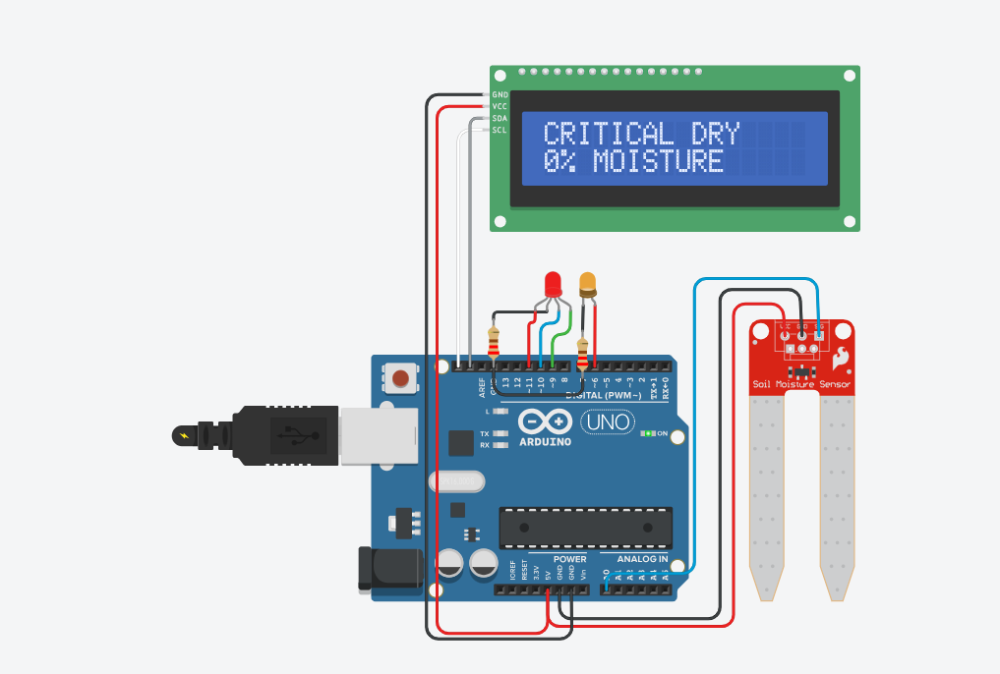

## Descrição do Circuito de Umidade (Circuito RC)

O circuito desenvolvido é um sensor de umidade baseado em um circuito RC (Resistor–Capacitor), que utiliza a variação da resistência elétrica para detectar o nível de umidade presente no ambiente ou no solo.

### Componentes principais:

Resistor (R): controla a corrente elétrica no circuito e define, junto com o capacitor, a constante de tempo de carga e descarga.

Capacitor (C): armazena energia elétrica temporariamente e libera aos poucos, dependendo da resistência no circuito.

Sensor de umidade: atua como uma resistência variável — quanto mais úmido o ambiente, menor a resistência; quanto mais seco, maior a resistência.

LED: utilizado como indicador visual. Sua intensidade de brilho muda conforme o nível de carga do capacitor, refletindo a umidade medida.

Fonte de energia: alimenta o circuito.

Chave (ou botão): controla o momento em que o capacitor começa a carregar ou descarregar.

Link do tinkercad.: https://www.tinkercad.com/things/4n1i4HLlZuw-copy-of-plant-man-comm-sys?sharecode=l8wCL6UOrk_vNyh6188pgj0wOibWe4ACkz0MMymYQWQ

## Por que usar Programação Orientada a Objetos (POO)?

Neste projeto, utilizamos **POO** para representar cada componente do circuito — como LED, resistor e capacitor — por meio de **classes** no código.

Cada classe possui seus **atributos e comportamentos**, o que torna o código mais próximo da realidade e muito mais organizado.
lista**.  
Além de facilitar a manutenção, também ajuda a compreender o comportamento dos componentes eletrônicos e como eles se relacionam entre si.
